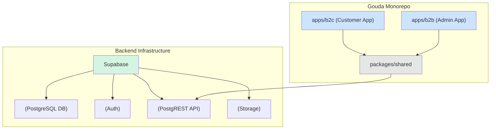

# Architecture Document: Gouda E-Commerce Platform

## 1. System Architecture Overview

The Gouda platform is built on a **monorepo architecture** to facilitate code sharing and streamline development across its different components. The architecture is composed of three main parts:

1.  **B2C Application**: A customer-facing mobile app.
2.  **B2B Application**: An administrative mobile app for business users.
3.  **Shared Packages**: A dedicated module for common code, including UI components, API clients, and utility functions.

The entire system is backed by **Supabase**, which provides the database, authentication, and a RESTful API layer.

## 2. Source Code Structure

The project is organized within a monorepo with the following key directories:

- `apps/b2c/`: Contains the source code for the customer-facing React Native application.
- `apps/b2b/`: Contains the source code for the administrative React Native application.
- `packages/shared/`: Houses shared code accessible by both applications.
  - `api/`: Supabase client configurations and data-fetching logic.
  - `components/`: Reusable React Native components (e.g., `Button`, `Input`).
  - `utils/`: Common utility functions.
- `supabase/`: Contains database migrations and Supabase-specific configurations.
  - `migrations/`: SQL files defining the database schema and RLS policies.

## 3. Key Technical Decisions & Design Patterns

### 3.1. Backend as a Service (BaaS)

**Decision**: Use **Supabase** as the primary backend.
**Rationale**:

- **Auto-generated APIs**: Supabase's PostgREST provides a ready-to-use RESTful API, significantly reducing backend development time.
- **Integrated Auth**: Built-in user authentication simplifies security and session management.
- **Scalability**: PostgreSQL offers a robust and scalable database solution.
- **Real-time Capabilities**: Supabase subscriptions can be leveraged for real-time features in the future.

### 3.2. Data Modeling & Security

**Decision**: A relational data model in PostgreSQL with **Row Level Security (RLS)**.
**Rationale**:

- **Data Integrity**: A relational schema enforces data consistency and relationships between entities like users, products, and orders.
- **Fine-Grained Access Control**: RLS is critical for a multi-vendor platform, ensuring that businesses can only access their own data and that customers can only view products from vendors they are authorized to buy from. Policies are defined directly in the database, providing a secure-by-default approach.

### 3.3. API Interaction

**Decision**: Primarily use Supabase's auto-generated **PostgREST API** for standard CRUD operations and **RPC (Remote Procedure Calls)** for complex business logic.
**Rationale**:

- **Efficiency**: Direct API access for simple operations is fast and requires no custom backend code.
- **Transactional Integrity**: For complex actions like creating an order from a cart (which involves multiple table updates), PostgreSQL functions exposed via RPC ensure the operations are performed atomically.

### 3.4. Frontend Architecture

**Decision**: Two separate **React Native with Expo** applications sharing a common package.
**Rationale**:

- **Separation of Concerns**: The B2C and B2B apps have distinct user bases and functionalities, justifying separate applications.
- **Code Reusability**: The `packages/shared` module prevents code duplication for common elements like UI components and API interaction logic.
- **Rapid Development**: Expo simplifies the build and deployment process for mobile applications.

## 4. Component Relationships & Data Flow

The typical data flow for a feature is as follows:

1.  **UI Component (in `apps/b2c` or `apps/b2b`)**: A user interacts with a component.
2.  **API Module (in `packages/shared/api`)**: The component calls a function from the shared API module.
3.  **Supabase Client**: The API module uses the Supabase client to make a request to the PostgREST API.
4.  **Supabase Backend**:
    - Supabase Auth verifies the user's JWT.
    - PostgREST receives the request.
    - RLS policies are applied to the query, ensuring the user has permission to access the requested data.
    - The query is executed against the PostgreSQL database.
5.  **Response**: The data is returned through the same chain to the UI component, which then updates its state and re-renders.

## 5. Database Schema

### 5.1 `profiles` Table

| Column Name  | Data Type | Constraints              | Description                                                                                    |
| :----------- | :-------- | :----------------------- | :--------------------------------------------------------------------------------------------- |
| `id`         | `uuid`    | PK, FK (`auth.users.id`) | Primary key, links to Supabase Auth user ID.                                                   |
| `username`   | `text`    | UNIQUE, NOT NULL         | User's chosen username.                                                                        |
| `full_name`  | `text`    | NULLABLE                 | User's full name.                                                                              |
| `avatar_url` | `text`    | NULLABLE                 | URL to user's avatar image.                                                                    |
| `role`       | `text`    | NOT NULL, DEFAULT 'user' | Global user role: 'admin', 'user'. Business-specific roles are managed in the `members` table. |

### 5.2 `products` Table

| Column Name      | Data Type | Constraints                                  | Description                                       |
| :--------------- | :-------- | :------------------------------------------- | :------------------------------------------------ |
| `id`             | `uuid`    | PK, DEFAULT `gen_random_uuid()`              | Unique product identifier.                        |
| `business_id`    | `uuid`    | FK (`organisations.id`) NOT NULL             | The business associated with the product.         |
| `name`           | `text`    | NOT NULL                                     | Product name.                                     |
| `description`    | `text`    | NULLABLE                                     | Detailed product description.                     |
| `status`         | `text`    | NOT NULL, DEFAULT 'draft'                    | Product status: 'draft', 'published', 'rejected'. |
| `price`          | `numeric` | NOT NULL                                     | Unit price of the product.                        |
| `image_url`      | `text`    | NULLABLE                                     | URL to product image.                             |
| `category_id`    | `uuid`    | FK (`categories.id`, `business_id`) NOT NULL | Category the product belongs to.                  |
| `stock_quantity` | `integer` | NOT NULL, DEFAULT 0                          | Current stock level.                              |

### 5.3 `categories` Table

| Column Name   | Data Type | Constraints                      | Description                                                          |
| :------------ | :-------- | :------------------------------- | :------------------------------------------------------------------- |
| `id`          | `uuid`    | PK, DEFAULT `gen_random_uuid()`  | Unique category identifier.                                          |
| `business_id` | `uuid`    | FK (`organisations.id`) NOT NULL | The business associated with the category.                           |
| `name`        | `text`    | NOT NULL                         | Category name (e.g., 'Dairy', 'Produce'). Unique with `business_id`. |

### 5.4 `carts` Table

| Column Name   | Data Type | Constraints                      | Description                            |
| :------------ | :-------- | :------------------------------- | :------------------------------------- |
| `id`          | `uuid`    | PK, DEFAULT `gen_random_uuid()`  | Unique cart identifier.                |
| `user_id`     | `uuid`    | FK (`profiles.id`), NOT NULL     | The user who owns the cart.            |
| `business_id` | `uuid`    | FK (`organisations.id`) NOT NULL | The business associated with the cart. |

### 5.5 `cart_items` Table

| Column Name            | Data Type | Constraints                     | Description                          |
| :--------------------- | :-------- | :------------------------------ | :----------------------------------- |
| `id`                   | `uuid`    | PK, DEFAULT `gen_random_uuid()` | Unique cart item identifier.         |
| `cart_id`              | `uuid`    | FK (`carts.id`), NOT NULL       | The cart this item belongs to.       |
| `product_id`           | `uuid`    | FK (`products.id`), NOT NULL    | The product in the cart.             |
| `quantity`             | `integer` | NOT NULL, DEFAULT 1             | Quantity of the product.             |
| `price_at_time_of_add` | `numeric` | NOT NULL                        | Price of product when added to cart. |

### 5.6 `orders` Table

| Column Name    | Data Type | Constraints                      | Description                                                      |
| :------------- | :-------- | :------------------------------- | :--------------------------------------------------------------- |
| `id`           | `uuid`    | PK, DEFAULT `gen_random_uuid()`  | Unique order identifier.                                         |
| `user_id`      | `uuid`    | FK (`profiles.id`), NOT NULL     | The user who placed the order.                                   |
| `business_id`  | `uuid`    | FK (`organisations.id`) NOT NULL | The business associated with the order.                          |
| `total_amount` | `numeric` | NOT NULL                         | Total amount of the order.                                       |
| `status`       | `text`    | NOT NULL, DEFAULT 'pending'      | Order status: 'pending', 'processing', 'completed', 'cancelled'. |

### 5.7 `order_items` Table

| Column Name              | Data Type | Constraints                     | Description                             |
| :----------------------- | :-------- | :------------------------------ | :-------------------------------------- |
| `id`                     | `uuid`    | PK, DEFAULT `gen_random_uuid()` | Unique order item identifier.           |
| `order_id`               | `uuid`    | FK (`orders.id`), NOT NULL      | The order this item belongs to.         |
| `product_id`             | `uuid`    | FK (`products.id`), NOT NULL    | The product in the order.               |
| `quantity`               | `integer` | NOT NULL                        | Quantity of the product.                |
| `price_at_time_of_order` | `numeric` | NOT NULL                        | Price of product when order was placed. |

### 5.8 `organisations` Table

| Column Name     | Data Type | Constraints                     | Description                                                                         |
| :-------------- | :-------- | :------------------------------ | :---------------------------------------------------------------------------------- |
| `id`            | `uuid`    | PK, DEFAULT `gen_random_uuid()` | Unique organisation identifier.                                                     |
| `name`          | `text`    | NOT NULL                        | Name of the business.                                                               |
| `address_line1` | `text`    | NOT NULL                        | Street address line 1.                                                              |
| `address_line2` | `text`    | NULLABLE                        | Street address line 2.                                                              |
| `city`          | `text`    | NOT NULL                        | City.                                                                               |
| `state`         | `text`    | NOT NULL                        | State/Province.                                                                     |
| `postal_code`   | `text`    | NOT NULL                        | Postal code.                                                                        |
| `country`       | `text`    | NOT NULL                        | Country.                                                                            |
| `status`        | `text`    | NOT NULL, DEFAULT 'pending'     | Current status of the organisation: 'pending', 'approved', 'suspended', 'rejected'. |

### 5.9 `members` Table

| Column Name        | Data Type | Constraints                           | Description                                                          |
| :----------------- | :-------- | :------------------------------------ | :------------------------------------------------------------------- |
| `profile_id`       | `uuid`    | PK, FK (`profiles.id`), NOT NULL      | The user's profile ID.                                               |
| `business_id`      | `uuid`    | PK, FK (`organisations.id`), NOT NULL | The organisation ID.                                                 |
| `role_in_business` | `text`    | NOT NULL                              | Role within the business (e.g., 'owner', 'sales_agent', 'customer'). |

## 6. Row Level Security (RLS) Policies

- **`profiles`**: Users can view and update their own profile. Owners/Sales Agents can view profiles associated with their business. Admins have full access.
- **`products`**: Owners/Sales Agents can manage products for their business. Customers can view published products from their authorized businesses. Admins have full access.
- **`categories`**: Owners can manage categories for their business. Customers, Owners, and Sales Agents can view them. Admins have full access.
- **`carts` / `cart_items`**: Users can manage their own cart. Owners/Sales Agents can manage carts for customers within their business.
- **`orders` / `order_items`**: Customers can manage their own orders (if 'pending'). Owners/Sales Agents can manage all orders for their business. Admins have full access.
- **`organisations`**: Owners can update their own organization's details. Customers and Sales Agents can view organizations they are members of. Admins have full access.
- **`members`**: Owners can manage memberships for their business. Sales Agents and Customers can view their own membership. Admins have full access.
