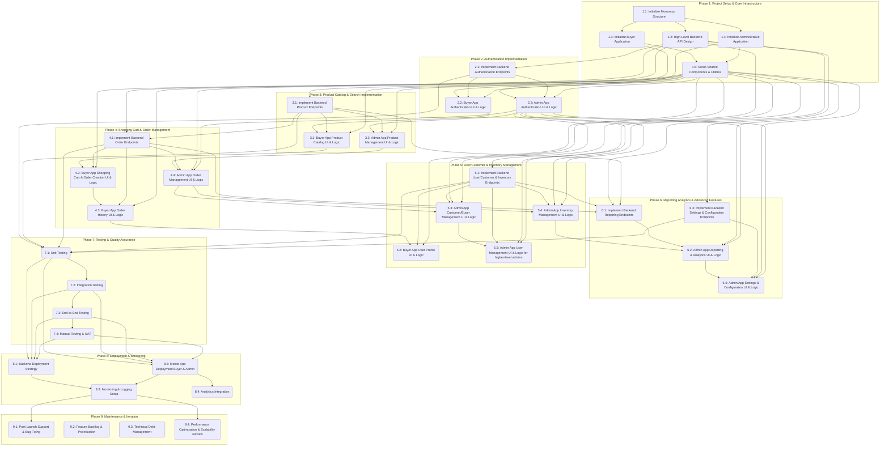

# Gouda Project - Detailed Implementation Plan

This document outlines a detailed step-by-step plan for building the Gouda B2B wholesale store platform, encompassing both the Buyer and Administrative mobile applications, and their underlying backend infrastructure. The plan is broken down into phases, tasks, and subtasks, with dependencies clearly identified.

## Project Overview

The Gouda project aims to develop a B2B wholesale store platform consisting of two main mobile applications:

1.  **Buyer Application**: A mobile interface for buyers to browse products, create orders, manage accounts, and view order history.
2.  **Administrative Application**: A mobile interface for store managers and seller agents to manage products, inventory, orders, buyers, and administrative users, with role-based functionalities.

Both applications will be built using React Native, Expo, and NativeWind for styling, supported by a robust backend API.

## Project Plan Diagram

## Detailed Plan Checklist

### 1. Project Setup & Core Infrastructure

- [ ] **Task 1.1: Initialize Monorepo Structure**

  - **Description**: Set up a monorepo (e.g., using Expo's built-in monorepo support or a tool like Nx/Lerna) to host both Buyer and Admin applications, and potentially a shared backend/common utilities.
  - **Dependencies**: None
  - **Subtasks**:
    - [ ] 1.1.1: Choose monorepo tool/strategy.
    - [ ] 1.1.2: Create root project directory and initialize monorepo.
    - [ ] 1.1.3: Configure basic monorepo settings (e.g., workspace definitions).

- [ ] **Task 1.2: High-Level Backend API Design**

  - **Description**: Define the essential API endpoints and data models required to support the core functionalities of both mobile applications. This is a conceptual design to guide frontend development.
  - **Dependencies**: None
  - **Subtasks**:
    - [ ] 1.2.1: Identify core entities (Users, Products, Orders, Inventory, etc.) and their relationships.
    - [ ] 1.2.2: Define API endpoints for user authentication (login, registration).
    - [ ] 1.2.3: Define API endpoints for product catalog (list, details, search).
    - [ ] 1.2.4: Define API endpoints for order management (create, view, update status).
    - [ ] 1.2.5: Define API endpoints for user/customer management.

- [ ] **Task 1.3: Initialize Buyer Application**

  - **Description**: Create the React Native/Expo project for the Buyer application within the monorepo and configure NativeWind for styling.
  - **Dependencies**: Task 1.1
  - **Subtasks**:
    - [ ] 1.3.1: Create new Expo project for Buyer app.
    - [ ] 1.3.2: Integrate NativeWind and Tailwind CSS configuration.
    - [ ] 1.3.3: Set up basic navigation structure (e.g., React Navigation).

- [ ] **Task 1.4: Initialize Administrative Application**

  - **Description**: Create the React Native/Expo project for the Administrative application within the monorepo and configure NativeWind for styling.
  - **Dependencies**: Task 1.1
  - **Subtasks**:
    - [ ] 1.4.1: Create new Expo project for Admin app.
    - [ ] 1.4.2: Integrate NativeWind and Tailwind CSS configuration.
    - [ ] 1.4.3: Set up basic navigation structure (e.g., React Navigation).

- [ ] **Task 1.5: Setup Shared Components & Utilities**
  - **Description**: Create a shared package/module within the monorepo for common UI components, utility functions, and potentially API client configurations that can be reused by both applications.
  - **Dependencies**: Task 1.1, Task 1.3, Task 1.4
  - **Subtasks**:
    - [ ] 1.5.1: Create a `shared` package/directory.
    - [ ] 1.5.2: Define initial common UI components (e.g., `Button`, `Input`).
    - [ ] 1.5.3: Implement a basic API client configuration for shared use.

### 2. Authentication Implementation

- [ ] **Task 2.1: Implement Backend Authentication Endpoints**

  - **Description**: Develop the necessary backend API endpoints for user registration, login, and potentially password reset for both buyer and administrative users.
  - **Dependencies**: Task 1.2
  - **Subtasks**:
    - [ ] 2.1.1: Implement user registration endpoint.
    - [ ] 2.1.2: Implement user login endpoint.
    - [ ] 2.1.3: Implement password reset/forgot password endpoint (if in scope).
    - [ ] 2.1.4: Define token-based authentication mechanism (e.g., JWT).

- [ ] **Task 2.2: Buyer App Authentication UI & Logic**

  - **Description**: Develop the user interface and integrate the authentication logic for the Buyer application (Login, Sign Up, Forgot Password screens).
  - **Dependencies**: Task 1.3, Task 1.5, Task 2.1
  - **Subtasks**:
    - [ ] 2.2.1: Create Login screen UI.
    - [ ] 2.2.2: Implement login API integration and state management.
    - [ ] 2.2.3: Create Sign Up/Registration screen UI.
    - [ ] 2.2.4: Implement registration API integration.
    - [ ] 2.2.5: Create Forgot Password screen UI (if in scope).
    - [ ] 2.2.6: Implement session management (e.g., storing tokens securely).

- [ ] **Task 2.3: Admin App Authentication UI & Logic**
  - **Description**: Develop the user interface and integrate the authentication logic for the Administrative application (Login screen).
  - **Dependencies**: Task 1.4, Task 1.5, Task 2.1
  - **Subtasks**:
    - [ ] 2.3.1: Create Admin Login screen UI.
    - [ ] 2.3.2: Implement admin login API integration and state management.
    - [ ] 2.3.3: Implement session management for admin users.
    - [ ] 2.3.4: Implement basic role-based redirection after login.

### 3. Product Catalog & Search Implementation

- [ ] **Task 3.1: Implement Backend Product Endpoints**

  - **Description**: Develop backend API endpoints for managing products (CRUD operations) and fetching product data, including search and filtering capabilities.
  - **Dependencies**: Task 1.2
  - **Subtasks**:
    - [ ] 3.1.1: Implement endpoint to list all products (with pagination/filtering).
    - [ ] 3.1.2: Implement endpoint to get product details by ID.
    - [ ] 3.1.3: Implement endpoint for product search.
    - [ ] 3.1.4: Implement endpoint for product category management.
    - [ ] 3.1.5: Implement endpoints for adding, editing, and deleting products (Admin only).

- [ ] **Task 3.2: Buyer App Product Catalog UI & Logic**

  - **Description**: Develop the UI and integrate logic for product browsing, search, filtering, and viewing product details in the Buyer application.
  - **Dependencies**: Task 1.3, Task 1.5, Task 2.2, Task 3.1
  - **Subtasks**:
    - [ ] 3.2.1: Create Product Listing/Catalog screen UI.
    - [ ] 3.2.2: Implement product list API integration and display.
    - [ ] 3.2.3: Create Search bar and filtering options UI.
    - [ ] 3.2.4: Implement search and filter logic with API integration.
    - [ ] 3.2.5: Create Product Details screen UI.
    - [ ] 3.2.6: Implement product details API integration.

- [ ] **Task 3.3: Admin App Product Management UI & Logic**
  - **Description**: Develop the UI and integrate logic for product management (viewing, adding, editing, organizing) in the Administrative application.
  - **Dependencies**: Task 1.4, Task 1.5, Task 2.3, Task 3.1
  - **Subtasks**:
    - [ ] 3.3.1: Create Admin Product List screen UI.
    - [ ] 3.3.2: Implement product list API integration for admin view.
    - [ ] 3.3.3: Create Add/Edit Product screen UI.
    - [ ] 3.3.4: Implement add/edit product API integration.
    - [ ] 3.3.5: Implement product category management UI.
    - [ ] 3.3.6: Implement product deletion functionality.

### 4. Shopping Cart & Order Management

- [ ] **Task 4.1: Implement Backend Order Endpoints**

  - **Description**: Develop backend API endpoints for managing shopping carts, creating orders, viewing order history, and updating order statuses.
  - **Dependencies**: Task 1.2, Task 3.1
  - **Subtasks**:
    - [ ] 4.1.1: Implement endpoints for shopping cart operations (add, remove, update quantity).
    - [ ] 4.1.2: Implement endpoint for creating a new order from a cart.
    - [ ] 4.1.3: Implement endpoint to list buyer's order history.
    - [ ] 4.1.4: Implement endpoint to get detailed order information.
    - [ ] 4.1.5: Implement endpoint to update order status (Admin only).
    - [ ] 4.1.6: Implement endpoint for seller agents to create orders on behalf of buyers.

- [ ] **Task 4.2: Buyer App Shopping Cart & Order Creation UI & Logic**

  - **Description**: Develop the UI and integrate logic for the shopping cart and the simplified order creation process in the Buyer application.
  - **Dependencies**: Task 1.3, Task 1.5, Task 3.2, Task 4.1
  - **Subtasks**:
    - [ ] 4.2.1: Create Shopping Cart screen UI.
    - [ ] 4.2.2: Implement add/remove/update quantity logic for cart with API integration.
    - [ ] 4.2.3: Implement 'Create Order' button and logic from cart.
    - [ ] 4.2.4: Create Order Confirmation screen UI.
    - [ ] 4.2.5: Implement order creation API integration and display confirmation.

- [ ] **Task 4.3: Buyer App Order History UI & Logic**

  - **Description**: Develop the UI and integrate logic for viewing past order history and status updates in the Buyer application.
  - **Dependencies**: Task 1.3, Task 1.5, Task 4.1
  - **Subtasks**:
    - [ ] 4.3.1: Create Order History list screen UI.
    - [ ] 4.3.2: Implement order history API integration and display.
    - [ ] 4.3.3: Create Order Details screen UI for buyers.
    - [ ] 4.3.4: Implement order details API integration for buyers.

- [ ] **Task 4.4: Admin App Order Management UI & Logic**
  - **Description**: Develop the UI and integrate logic for viewing, managing, and updating the status of orders in the Administrative application.
  - **Dependencies**: Task 1.4, Task 1.5, Task 2.3, Task 4.1
  - **Subtasks**:
    - [ ] 4.4.1: Create Admin Order List screen UI.
    - [ ] 4.4.2: Implement order list API integration for admin view (with search/filter).
    - [ ] 4.4.3: Create Admin Order Details screen UI.
    - [ ] 4.4.4: Implement order details API integration for admin.
    - [ ] 4.4.5: Implement 'Update Order Status' functionality with API integration.
    - [ ] 4.4.6: Create 'Create Order for Buyer' screen UI (for Seller Agent).
    - [ ] 4.4.7: Implement 'Create Order for Buyer' API integration and logic.

### 5. User/Customer & Inventory Management

- [ ] **Task 5.1: Implement Backend User/Customer & Inventory Endpoints**

  - **Description**: Develop backend API endpoints for managing buyer profiles, shipping addresses, and administrative user accounts, as well as inventory levels.
  - **Dependencies**: Task 1.2
  - **Subtasks**:
    - [ ] 5.1.1: Implement endpoint to get/update buyer profile.
    - [ ] 5.1.2: Implement endpoints for managing buyer shipping addresses (add, edit, delete).
    - [ ] 5.1.3: Implement endpoint to list all buyers (Admin only).
    - [ ] 5.1.4: Implement endpoints for adding/editing buyer accounts (Admin only).
    - [ ] 5.1.5: Implement endpoint to list inventory levels.
    - [ ] 5.1.6: Implement endpoint to adjust inventory levels (Admin only).
    - [ ] 5.1.7: Implement endpoints for managing administrative users and roles (Super Admin only).

- [ ] **Task 5.2: Buyer App User Profile UI & Logic**

  - **Description**: Develop the UI and integrate logic for viewing and editing personal information and managing shipping addresses in the Buyer application.
  - **Dependencies**: Task 1.3, Task 1.5, Task 5.1
  - **Subtasks**:
    - [ ] 5.2.1: Create My Account/Profile screen UI.
    - [ ] 5.2.2: Implement profile data fetching and update API integration.
    - [ ] 5.2.3: Create Saved Addresses screen UI.
    - [ ] 5.2.4: Implement shipping address management (add, edit, delete) with API integration.

- [ ] **Task 5.3: Admin App Customer/Buyer Management UI & Logic**

  - **Description**: Develop the UI and integrate logic for viewing and managing buyer accounts in the Administrative application.
  - **Dependencies**: Task 1.4, Task 1.5, Task 2.3, Task 5.1
  - **Subtasks**:
    - [ ] 5.3.1: Create Admin Buyer List screen UI.
    - [ ] 5.3.2: Implement buyer list API integration.
    - [ ] 5.3.3: Create Buyer Details screen UI.
    - [ ] 5.3.4: Implement buyer details API integration.
    - [ ] 5.3.5: Create Add/Edit Buyer screen UI.
    - [ ] 5.3.6: Implement add/edit buyer API integration.

- [ ] **Task 5.4: Admin App Inventory Management UI & Logic**
  - **Description**: Develop the UI and integrate logic for monitoring and adjusting inventory levels in the Administrative application.
  - **Dependencies**: Task 1.4, Task 1.5, Task 2.3, Task 5.1
  - **Subtasks**:
    - [ ] 5.4.1: Create Inventory List screen UI.
    - [ ] 5.4.2: Implement inventory list API integration.
    - [ ] 5.4.3: Implement 'Adjust Inventory' functionality with API integration.
    - [ ] 5.4.4: Implement Low Stock Alerts display (if applicable).\
- [ ] **Task 5.5: Admin App User Management UI & Logic (for higher-level admins)**
  - **Description**: Develop the UI and integrate logic for managing administrative user accounts and permissions.
  - **Dependencies**: Task 1.4, Task 1.5, Task 2.3, Task 5.1
  - **Subtasks**:
    - [ ] 5.5.1: Create Admin User List screen UI.
    - [ ] 5.5.2: Implement admin user list API integration.
    - [ ] 5.5.3: Create Add/Edit Admin User screen UI.
    - [ ] 5.5.4: Implement add/edit admin user API integration (including role assignment).

### 6. Reporting, Analytics & Advanced Features

- [ ] **Task 6.1: Implement Backend Reporting Endpoints**

  - **Description**: Develop backend API endpoints to generate various reports (e.g., sales, inventory) and potentially handle pricing rules/discounts.
  - **Dependencies**: Task 1.2, Task 3.1, Task 4.1, Task 5.1
  - **Subtasks**:
    - [ ] 6.1.1: Implement endpoint for sales reports (by product, buyer, date range).
    - [ ] 6.1.2: Implement endpoint for inventory reports.
    - [ ] 6.1.3: Implement endpoints for managing pricing rules and discounts (if applicable).

- [ ] **Task 6.2: Admin App Reporting & Analytics UI & Logic**

  - **Description**: Develop the UI and integrate logic for accessing and displaying various reports in the Administrative application.
  - **Dependencies**: Task 1.4, Task 1.5, Task 2.3, Task 6.1
  - **Subtasks**:
    - [ ] 6.2.1: Create Sales Reports screen UI.
    - [ ] 6.2.2: Implement sales report API integration and data visualization.
    - [ ] 6.2.3: Create Inventory Reports screen UI.
    - [ ] 6.2.4: Implement inventory report API integration.

- [ ] **Task 6.3: Implement Backend Settings & Configuration Endpoints**

  - **Description**: Develop backend API endpoints for managing general application settings, pricing rules, shipping methods, and payment gateways.
  - **Dependencies**: Task 1.2
  - **Subtasks**:
    - [ ] 6.3.1: Implement endpoints for general settings.
    - [ ] 6.3.2: Implement endpoints for pricing rules.
    - [ ] 6.3.3: Implement endpoints for shipping methods.
    - [ ] 6.3.4: Implement endpoints for payment gateway settings.

- [ ] **Task 6.4: Admin App Settings & Configuration UI & Logic**
  - **Description**: Develop the UI and integrate logic for managing application settings, pricing rules, shipping methods, and payment gateways in the Administrative application.
  - **Dependencies**: Task 1.4, Task 1.5, Task 2.3, Task 6.3
  - **Subtasks**:
    - [ ] 6.4.1: Create General Settings screen UI.
    - [ ] 6.4.2: Implement general settings API integration.
    - [ ] 6.4.3: Create Pricing Rules screen UI.
    - [ ] 6.4.4: Implement pricing rules API integration.
    - [ ] 6.4.5: Create Shipping Methods screen UI.
    - [ ] 6.4.6: Implement shipping methods API integration.
    - [ ] 6.4.7: Create Payment Gateway Settings screen UI.
    - [ ] 6.4.8: Implement payment gateway settings API integration.

### 7. Testing & Quality Assurance

- [ ] **Task 7.1: Unit Testing**

  - **Description**: Write unit tests for individual functions, components, and API client modules in both applications and the backend.
  - **Dependencies**: All previous development tasks (as code is written)
  - **Subtasks**:
    - [ ] 7.1.1: Set up testing frameworks (e.g., Jest for React Native, appropriate framework for backend).
    - [ ] 7.1.2: Write unit tests for shared utilities.
    - [ ] 7.1.3: Write unit tests for authentication logic.
    - [ ] 7.1.4: Write unit tests for data models and API client functions.

- [ ] **Task 7.2: Integration Testing**

  - **Description**: Write integration tests to ensure different modules and services (frontend-backend, component interactions) work correctly together.
  - **Dependencies**: Task 7.1
  - **Subtasks**:
    - [ ] 7.2.1: Write integration tests for user authentication flow.
    - [ ] 7.2.2: Write integration tests for product browsing and ordering flow.
    - [ ] 7.2.3: Write integration tests for admin management flows.

- [ ] **Task 7.3: End-to-End (E2E) Testing**

  - **Description**: Implement E2E tests to simulate real user scenarios across the entire application stack.
  - **Dependencies**: Task 7.2
  - **Subtasks**:
    - [ ] 7.3.1: Choose an E2E testing framework (e.g., Detox for React Native).
    - [ ] 7.3.2: Write E2E tests for critical user journeys (e.g., buyer registration to order placement).
    - [ ] 7.3.3: Write E2E tests for critical admin workflows (e.g., product creation to order status update).

- [ ] **Task 7.4: Manual Testing & User Acceptance Testing (UAT)**
  - **Description**: Conduct manual testing and prepare for UAT with stakeholders to validate features against requirements.
  - **Dependencies**: All development and automated testing tasks completed.
  - **Subtasks**:
    - [ ] 7.4.1: Develop manual test cases based on PRDs.
    - [ ] 7.4.2: Perform internal manual testing.
    - [ ] 7.4.3: Prepare UAT environment and test plan.
    - [ ] 7.4.4: Conduct UAT with target users/stakeholders.

### 8. Deployment & Monitoring

- [ ] **Task 8.1: Backend Deployment Strategy**

  - **Description**: Define and implement the deployment strategy for the backend API (e.g., cloud provider, serverless functions, containerization).
  - **Dependencies**: All backend development tasks completed.
  - **Subtasks**:
    - [ ] 8.1.1: Choose cloud provider/hosting solution.
    - [ ] 8.1.2: Set up CI/CD pipeline for backend deployment.
    - [ ] 8.1.3: Configure production environment variables and secrets.

- [ ] **Task 8.2: Mobile App Deployment (Buyer & Admin)**

  - **Description**: Prepare and deploy both React Native applications to respective app stores (Apple App Store, Google Play Store) or internal distribution channels.
  - **Dependencies**: All frontend development and testing tasks completed.
  - **Subtasks**:
    - [ ] 8.2.1: Configure Expo build profiles for production.
    - [ ] 8.2.2: Generate app binaries (APK, AAB, IPA).
    - [ ] 8.2.3: Set up app store listings and metadata.
    - [ ] 8.2.4: Submit apps for review/publish.

- [ ] **Task 8.3: Monitoring & Logging Setup**

  - **Description**: Implement monitoring and logging solutions for both backend and mobile applications to track performance, errors, and user behavior.
  - **Dependencies**: Task 8.1, Task 8.2
  - **Subtasks**:
    - [ ] 8.3.1: Integrate logging libraries/services (e.g., Sentry, Crashlytics).
    - [ ] 8.3.2: Set up performance monitoring (e.g., APM tools).
    - [ ] 8.3.3: Configure alerts for critical errors or performance degradation.

- [ ] **Task 8.4: Analytics Integration**
  - **Description**: Integrate analytics tools to gather insights on user engagement and application usage.
  - **Dependencies**: Task 8.2
  - **Subtasks**:
    - [ ] 8.4.1: Choose an analytics platform (e.g., Google Analytics, Firebase Analytics).
    - [ ] 8.4.2: Integrate analytics SDKs into both mobile apps.
    - [ ] 8.4.3: Define key events and user properties to track.

### 9. Maintenance & Iteration

- [ ] **Task 9.1: Post-Launch Support & Bug Fixing**

  - **Description**: Establish processes for ongoing support, bug reporting, and hotfixes post-launch.
  - **Dependencies**: Task 8.3
  - **Subtasks**:
    - [ ] 9.1.1: Set up bug tracking system.
    - [ ] 9.1.2: Define bug triage and resolution process.
    - [ ] 9.1.3: Plan for emergency hotfix deployments.

- [ ] **Task 9.2: Feature Backlog & Prioritization**

  - **Description**: Maintain a backlog of future features and enhancements, and establish a process for their prioritization and planning.
  - **Dependencies**: Ongoing user feedback, business needs.
  - **Subtasks**:
    - [ ] 9.2.1: Create and maintain a feature backlog.
    - [ ] 9.2.2: Implement a feature prioritization framework.
    - [ ] 9.2.3: Plan for regular sprint/iteration cycles for new feature development.

- [ ] **Task 9.3: Technical Debt Management**

  - **Description**: Regularly review and address technical debt to ensure the long-term health and maintainability of the codebase.
  - **Dependencies**: Ongoing development.
  - **Subtasks**:
    - [ ] 9.3.1: Schedule regular code reviews and refactoring sessions.
    - [ ] 9.3.2: Allocate dedicated time for technical debt reduction in sprints.

- [ ] **Task 9.4: Performance Optimization & Scalability Review**
  - **Description**: Continuously monitor application performance and review scalability needs, making optimizations as required.
  - **Dependencies**: Task 8.3
  - **Subtasks**:
    - [ ] 9.4.1: Regularly review performance metrics.
    - [ ] 9.4.2: Identify and address performance bottlenecks.
    - [ ] 9.4.3: Plan for infrastructure scaling as user base grows.
